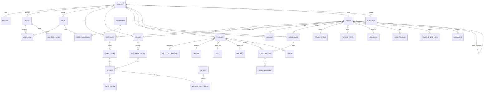

# Database Design — ER Diagram & Schema Notes

The authoritative schema lives in
[`apps/api/prisma/schema.prisma`](../apps/api/prisma/schema.prisma)
(~40 models). Below is the core trade-centric subset as a Mermaid ER diagram,
followed by the indexing, soft-delete and scaling strategy.

## Core ER diagram (trade-centric)



## Model groups (~40 tables)

| Group        | Tables |
| ------------ | ------ |
| Tenant/Org   | `companies`, `branches` |
| Auth/RBAC    | `users`, `refresh_tokens`, `roles`, `permissions`, `role_permissions`, `user_roles` |
| Master data  | `customers`, `vendors`, `brokers`, `products`, `product_categories`, `brands`, `warehouses`, `packaging_types`, `units`, `payment_terms`, `logistics_providers`, `banks`, `currencies`, `tax_rates`, `departments`, `designations`, `employees`, `trade_statuses` |
| Trade        | `trades`, `trade_timeline`, `trade_activity_logs` |
| Purchase     | `purchase_orders`, `purchase_order_items` |
| Sales        | `sales_orders`, `sales_order_items`, `dispatches` |
| Finance      | `invoices`, `invoice_items`, `payments`, `payment_allocations`, `credit_debit_notes`, `journal_entries`, `journal_lines` |
| Inventory    | `batches`, `stock_ledger`, `stock_movements` |
| Documents    | `documents`, `document_versions` |
| Workflow     | `tasks`, `task_comments`, `reminders`, `notifications`, `approvals` |
| System       | `audit_logs`, `number_sequences`, `settings` |

## Conventions

| Concern    | Rule |
| ---------- | ---- |
| PK         | `cuid()` string ids |
| Money      | `Decimal(18,4)` |
| Quantity   | `Decimal(18,3)` |
| Rates / %  | `Decimal(9,4)` / `Decimal(18,6)` for FX |
| Audit cols | `createdAt`, `updatedAt`, `createdById`/`updatedById` where relevant |
| Soft delete| `deletedAt DateTime?` (NULL = active) on all business tables |
| Tenancy    | `companyId` on every business table |

## Indexing strategy

Single-column + **composite** indexes target real query paths:

- `trades`:
  - `@@unique([companyId, tradeNo])`
  - `@@index([companyId, deletedAt])`, `([companyId, tradeDate])`,
    `([companyId, statusId])`, `([companyId, productId])`,
    `([companyId, customerId])`, `([companyId, vendorId])`,
    `([companyId, brokerId])`, `([companyId, traderId])`
  - **Dashboard hot path** — `@@index([companyId, deletedAt, statusId, tradeDate])`
- `invoices`: `([companyId, kind, status])`, `([companyId, dueDate])` for aging.
- `payments`: `([companyId, direction, paymentDate])` for daily collections.
- `audit_logs`: `([companyId, createdAt])`, `([companyId, entityType, entityId])`,
  `([companyId, action])`.
- `stock_movements`: `([companyId, ledgerId, createdAt])`, `([refType, refId])`.
- Master data: `@@unique([companyId, code|name])` + `([companyId, deletedAt])`.

## Soft-delete strategy

- Reads filter `deletedAt: null` (enforced in `BaseRepository` /
  `MasterCrudService`).
- Deletes set `deletedAt = now()`; `restore()` nulls it.
- Audit & restore flows can read deleted rows explicitly — which is exactly why
  soft delete is implemented in the repository layer rather than a blanket
  Prisma middleware.

## Recommended views / materialized views (scale path)

As volume grows toward millions of rows, add (migrations):

```sql
-- Outstanding receivables/payables per party (view)
CREATE VIEW v_party_outstanding AS
SELECT "companyId", "customerId" AS party_id, 'CUSTOMER' AS party_type,
       SUM(outstanding) AS outstanding
FROM invoices
WHERE "deletedAt" IS NULL AND kind = 'SALES'
GROUP BY "companyId", "customerId";

-- Monthly trade rollup (materialized — refresh nightly / on write)
CREATE MATERIALIZED VIEW mv_trade_monthly AS
SELECT "companyId", date_trunc('month', "tradeDate") AS month,
       count(*) AS trades, sum("grossValue") AS revenue,
       sum(profit) AS profit, sum(quantity) AS volume
FROM trades
WHERE "deletedAt" IS NULL
GROUP BY 1, 2;
CREATE UNIQUE INDEX ON mv_trade_monthly ("companyId", month);
-- REFRESH MATERIALIZED VIEW CONCURRENTLY mv_trade_monthly;
```

## Partitioning (very high volume)

`audit_logs` and `trade_timeline` are append-only and time-ordered — natural
candidates for **range partitioning by `createdAt`** (monthly) once they grow
large, keeping the indexes above per partition.
